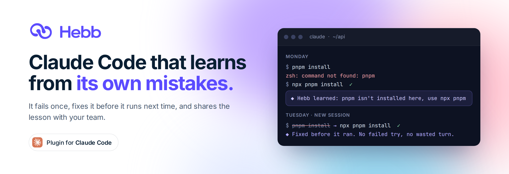
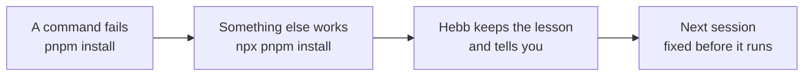

<p align="center">
  <picture>
    <source media="(prefers-color-scheme: dark)" srcset=".github/assets/banner-dark.png">
    
  </picture>
</p>

<p align="center">
  <a href="#install"><b>Install</b></a> &nbsp;·&nbsp;
  <a href="#how-it-works"><b>How it works</b></a> &nbsp;·&nbsp;
  <a href="#for-teams"><b>Teams</b></a> &nbsp;·&nbsp;
  <a href="#what-leaves-your-computer"><b>Privacy</b></a> &nbsp;·&nbsp;
  <a href="#faq"><b>FAQ</b></a> &nbsp;·&nbsp;
  <a href="https://hebb-site.pages.dev"><b>Website</b></a>
</p>

<p align="center">
  
  
  
  
</p>

<br>

Claude Code forgets your machine every session. It runs `python`, finds out you only have
`python3`, and does exactly the same thing tomorrow. Every failed command is a wasted turn you pay
for.

**Hebb makes it learn.** When a command fails and something else works, Hebb keeps that as a
lesson. Next time, it fixes the command before it runs. You never write anything down, and your
whole team can share what it learns.

## Install

In Claude Code, run these one at a time:

```
/plugin marketplace add hilothefunnydog123-coder/hebb-claude-plugin
```
```
/plugin install hebb@hebb
```

Restart Claude Code. A browser tab opens once and you sign in to Hebb with a free account. That's
the whole setup. Run `/hebb:login` any time to sign in again.

<details>
<summary>From a terminal instead</summary>

```bash
claude plugin marketplace add hilothefunnydog123-coder/hebb-claude-plugin
claude plugin install hebb@hebb
```

</details>

## How it works



1. **It watches.** Hooks see every shell command Claude runs and whether it worked.
2. **It learns.** A failure followed by a fix becomes one short lesson, announced in your session.
3. **It fixes and reminds.** Before Claude acts, the lessons that matter are put in front of it,
   and a command it knows is wrong is corrected before it runs.

## What you get

| Feature | In practice |
|---|---|
| **Learns from failures, by itself** | A command fails, a different one works, and Hebb keeps that pair. No notes to maintain. |
| **Fixes commands before they run** | `python` becomes `python3` before execution: no failed attempt, no tokens spent on it. |
| **Refuses what you banned** | "Never run `git push --force`" becomes a hard block, not a suggestion. |
| **Remembers what you tell it** | Preferences and conventions carry across sessions, projects and machines, with how old each one is. |
| **Works across your AI apps** | The same memory is in Claude, ChatGPT, Gemini and Cursor through [Hebb's connector](https://hebb-site.pages.dev/mcp.html). |

## Results

In our first test, 112 Claude Code sessions on simulated computers that were missing common tools,
on tasks the agent had never seen before:

| Claude Code with Hebb, against plain Claude Code | |
|---|---:|
| Failed commands | **81% fewer** |
| Agent turns | **31% fewer** |
| Tokens used | **33% fewer** |
| AI cost | **22% lower** |

Agents that had never touched the machine, and learned only from lessons other agents had shared,
made **75% fewer** failed commands. This is an early pilot on one model; a larger study is next,
and results will vary with your setup.

## For teams

One person hits the problem and everybody's assistant learns it.

- **Share on purpose.** Nothing learned automatically leaves your account. A lesson reaches the team
  only when someone shares it, because what's missing on your laptop isn't missing on theirs.
- **Agents propose, people approve.** A lesson a teammate's assistant shares waits for an owner or
  admin to approve it in the dashboard. An assistant can never approve its own lesson.
- **Guardrails that stick.** Ban a command once, after one incident, and it's refused for everyone,
  with the reason and who set it.
- **Every change can be undone.** Who changed what, from which app and when is recorded, and any
  earlier version can be put back with one click.

Create a team in the [dashboard](https://hebb-site.pages.dev/dashboard.html) and share the invite
code.

## What leaves your computer

The hooks are the one part of Hebb that learns without being asked, so here is exactly what they
send:

- **Lessons, not logs.** When a command fails and a different one then works, the hooks save one
  short lesson, such as "`pnpm` is not installed on *your computer's name*, use `npx pnpm`
  instead". A lesson can contain the two commands, cut to 160 characters each, and your computer's
  name.
- **Never anything that looks like a secret.** A command that looks like it contains a password,
  key or token is never saved.
- **Not your prompts.** To tell Claude what it already knows, the hooks download your saved
  memories and match them against your prompt on your own computer. Your prompts and commands are
  not sent to Hebb for this, and neither is the check against banned commands.

Every lesson is announced in your session as it's learned, and you can see and delete everything
in the [dashboard](https://hebb-site.pages.dev/dashboard.html). Deleting gives you a receipt. The
full [privacy policy](https://hebb-site.pages.dev/privacy.html) covers the rest, and every line of
code that runs on your computer is in this repository.

## Commands

| Type this | It does |
|---|---|
| `/hebb:login` | Sign in, or sign in again |
| `/hebb:login --switch` | Switch to another Hebb account |
| `/hebb:login --device` | Sign in without a browser on this machine |
| "Am I connected to Hebb?" | Claude checks for you |
| "Log me out of Hebb" | Signs out on this machine. Revoke the key in the dashboard to cut it off everywhere. |

You can also just ask Claude: *"remember that we deploy with `make ship`"*, *"never run
`terraform destroy`"*, or *"what do you know about this project?"*

## Settings

| Environment variable | What it does |
|---|---|
| `HEBB_NO_AUTO_LOGIN=1` | Don't open the browser at startup when signed out (it opens at most once a day anyway) |
| `HEBB_NO_REWRITE=1` | Keep the memory, but stop correcting commands before they run |

## FAQ

<details>
<summary><b>Isn't this just a CLAUDE.md file?</b></summary>
<br>

A notes file only knows what someone remembers to write in it, and it goes stale. Hebb learns from
what actually happened, with nobody writing anything. In our pilot we also compared Hebb against
Claude keeping its own notes file, asked to update it after every task: both avoided the same
mistakes, and Hebb used 40% fewer tokens and 36% fewer turns doing it, because the agent spends no
effort maintaining notes. Notes files are still great for what people write on purpose, like
project plans. Hebb is for what the agent learns.
</details>

<details>
<summary><b>What if it learns something wrong?</b></summary>
<br>

Every lesson is announced when it's learned, so you see it right away. Delete it by asking Claude
to forget it, or in the dashboard. In a team, shared lessons can require approval, anything that
looks like an attack is held back until a person reviews it, and every change can be undone.
</details>

<details>
<summary><b>Does it slow Claude Code down or use up my context?</b></summary>
<br>

The hooks are plain Python with no dependencies. They fetch your memories at most once a minute
and match them against your prompt on your own machine, so there's no round trip on every prompt.
The memory tools have short descriptions, and a lesson is only added to your prompt when it's
relevant.
</details>

<details>
<summary><b>Does it cost anything?</b></summary>
<br>

The free plan includes 50 memories, 500 saves and 10,000 lookups a month.
</details>

<details>
<summary><b>How do I remove it?</b></summary>
<br>

`claude plugin uninstall hebb@hebb`. Delete `~/.hebb` to remove the key and local state from this
computer, and revoke the key in the dashboard to disconnect it everywhere.
</details>

## Good to know

- Needs Python 3 (`python3` on your PATH). Standard library only, nothing else to install.
- Your key lives in `~/.hebb/key`, readable only by you, and shows up in the dashboard as
  "Connected: Claude Code on *your machine*".
- If you set Hebb up earlier by pasting commands from the dashboard, remove that setup. The plugin
  warns you if both are installed.

## Support

Questions and bugs: [open an issue](https://github.com/hilothefunnydog123-coder/hebb-claude-plugin/issues)
or email neilgilani@gmail.com. Security problems: see [SECURITY.md](SECURITY.md).

## License

Apache-2.0. See [LICENSE](LICENSE).

<p align="center"><sub>Hebb is an independent project and is not affiliated with or endorsed by Anthropic. Claude and Claude Code are trademarks of Anthropic.</sub></p>
