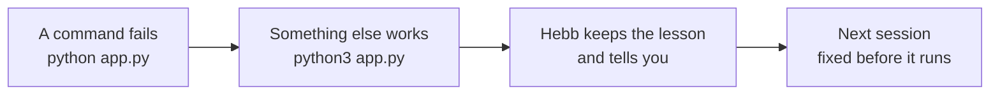

<p align="center">
  
</p>

<p align="center">
  <a href="#install"><b>Install</b></a> &nbsp;·&nbsp;
  <a href="#how-it-works"><b>How it works</b></a> &nbsp;·&nbsp;
  <a href="#examples"><b>Examples</b></a> &nbsp;·&nbsp;
  <a href="#for-teams"><b>Teams</b></a> &nbsp;·&nbsp;
  <a href="#what-leaves-your-computer"><b>Privacy</b></a> &nbsp;·&nbsp;
  <a href="#faq"><b>FAQ</b></a> &nbsp;·&nbsp;
  <a href="https://hebb-site.pages.dev"><b>Website</b></a>
</p>

<p align="center">
  
  
  
  
</p>

<br>

<p align="center">
  
</p>

Claude Code forgets your machine every session. It runs `python`, finds out you only have
`python3`, and does exactly the same thing tomorrow. **Hebb makes it learn:** a command that failed
once is stopped before it runs again, and Claude is handed the one that works. No notes to write,
no account needed.

## Install

In Claude Code, run these one at a time:

```
/plugin marketplace add NeilGilani/hebb-claude-plugin
```
```
/plugin install hebb@hebb
```

That's it. When Claude Code asks for a Hebb key, leave it empty: Hebb runs in **local mode** and
everything it learns stays on your computer. Start a new session and it's on.

**Want it on your team, or on more than one computer?** Get a free key from the
[Hebb dashboard](https://hebb-site.pages.dev/dashboard.html?connect=claude) (**Make my key**) and add
it to the plugin with `/plugin`. Claude Code keeps it in your system's credential store, not in a
file.

## How it works



1. **It watches.** Hooks see every shell command Claude runs and whether it worked.
2. **It learns.** A failure followed by a fix becomes one short lesson, announced in your session.
3. **It catches and reminds.** Before Claude acts, the lessons that matter are put in front of it.
   A command that uses a program this machine is known not to have is stopped before it runs, and
   Claude is handed the corrected command to run instead.

## What you get

| Feature | In practice |
|---|---|
| **Learns from failures, by itself** | A command fails, a different one works, and Hebb keeps that pair. No notes to maintain. |
| **Catches known mistakes before they run** | `python app.py` on a machine with only `python3` is stopped, and Claude runs `python3 app.py` instead: no failed command, no error to read. |
| **Refuses what you banned** | "Never run `git push --force`" becomes a hard block, not a suggestion. |
| **Remembers what you tell it** | Preferences and conventions carry across sessions and projects (and machines, with a key), with how old each one is. |
| **Works across your AI apps** | The same memory is in Claude, ChatGPT, Gemini and Cursor through [Hebb's connector](https://hebb-site.pages.dev/mcp.html), with a key. |

## Examples

Each of these works as soon as the plugin is installed, with or without a key. The lines starting with
`hebb` are what the plugin prints in your session.

**1. It learns a fix by itself.** On a Mac with no `python`, Claude runs a script:

```
$ python app.py
zsh: command not found: python
hebb learned: missing: python -> `python` is not installed on neils-mac.

$ python3 app.py        # works
hebb learned: missing: python -> `python` is not installed on neils-mac -- use `python3` instead.
```

Next session, or next week, Claude writes `python manage.py test`. Hebb stops it before it runs
and tells Claude why, with the command that works:

```
hebb caught it: python -> python3
Not run: `python` is not installed on this machine, `python3` is (Hebb learned this here earlier).
Run this instead: python3 manage.py test
```

Claude runs `python3 manage.py test`. The command that would have failed never ran.

**2. You ban a command once.** Tell Claude:

> Never run `terraform destroy`. We lost staging to it.

Claude saves the ban. From then on, in any session, if Claude tries it the command is stopped
before it runs and Claude tells you why:

```
Blocked by your saved rule 'never: terraform destroy': We lost staging to it.
```

In a team, the ban applies to everyone's Claude Code. Undo it by asking Claude to forget it.

**3. It remembers what you tell it.** Say *"remember that we deploy with `make ship`, never by
hand"*. In a new session a week later, ask *"how do we deploy this?"* and Claude answers from
memory, saying how old the memory is, instead of guessing or asking you again.

**4. Your team gets it too** (needs a key). Say *"share the python lesson with my team"*. Every teammate's
Claude Code now has it. If your team requires approval, it waits in the
[dashboard](https://hebb-site.pages.dev/dashboard.html) until an owner or admin approves it.

## Results

In our first test, 112 Claude Code sessions on simulated computers that were missing common tools,
on tasks the agent had never seen before:

| Claude Code with Hebb, against plain Claude Code | |
|---|---:|
| Failed commands | **81% fewer** |
| Agent turns | **31% fewer** |
| Tokens used | **33% fewer** |
| AI cost | **22% lower** |

Agents that had never touched the machine, and learned only from lessons other agents had shared,
made **75% fewer** failed commands. This is an early pilot on one model; a larger study is next,
and results will vary with your setup. The pilot ran version 0.3, which swapped a known-bad program
for the working one by itself. Version 0.4 stops the command and hands Claude the fix instead, as
the Claude plugin directory requires, which can cost Claude one extra step. We are measuring it
again.

## For teams

One person hits the problem and everybody's assistant learns it.

- **Share on purpose.** Nothing learned automatically leaves your account. A lesson reaches the team
  only when someone shares it, because what's missing on your laptop isn't missing on theirs.
- **Agents propose, people approve.** A lesson a teammate's assistant shares waits for an owner or
  admin to approve it in the dashboard. An assistant can never approve its own lesson.
- **Guardrails that stick.** Ban a command once, after one incident, and it's refused for everyone,
  with the reason and who set it.
- **Every change can be undone.** Who changed what, from which app and when is recorded, and any
  earlier version can be put back with one click.

Create a team in the [dashboard](https://hebb-site.pages.dev/dashboard.html) and share the invite
code.

## Guardrails you can check

**Bans are hard to talk around.** A banned command is matched the way a shell reads it, not as
text. `never: git push --force` also stops `git push -f`, `git push origin main --force`,
`sudo git push --force`, `bash -c 'git push -f'`, `eval`, `$(...)`, a command assembled from
variables, and the same command base64-encoded and piped into a shell. `-rf` counts as `-r -f`,
and `--force-with-lease` is not mistaken for `--force`.

**A history that shows tampering.** Every lesson learned, command blocked, mistake corrected and
memory deleted goes into one log on your machine, and each entry is sealed with the SHA-256 of the
one before it. `/hebb:memory history` shows the last entries, how many commands Hebb blocked and
corrected this week, and whether the record is intact. Edit or delete any entry and it says exactly
where the chain breaks. It is evidence, not a lock: someone who rewrites the whole file and every
hash isn't stopped, but quietly changing one line is caught. Commands that look like they contain a
secret are never written to it.

## What leaves your computer

**Without a key, nothing.** In local mode your memories are one file in Claude Code's data folder
for the plugin, and it is removed when you uninstall. The rest of this section is about what the
plugin sends once you add a key. The hooks are the one part of Hebb that learns without being asked,
so here is exactly what they send:

- **Lessons, not logs.** When a command fails and a different one then works, the hooks save one
  short lesson, such as "`python` is not installed on *your computer's name*, use `python3`
  instead". A lesson can contain the two commands, cut to 160 characters each, and your computer's
  name.
- **Never anything that looks like a secret.** A command that looks like it contains a password,
  key or token is never saved.
- **Not your prompts.** To tell Claude what it already knows, the hooks download your saved
  memories and match them against your prompt on your own computer. Your prompts and commands are
  not sent to Hebb for this, and neither is the check against banned commands.

**Where it goes.** With a key, everything the plugin sends goes to one place: Hebb's API at
`https://hebb-site.pages.dev/v1`, over HTTPS. The API runs on Cloudflare, and your account and
memories are stored in a Supabase database. That covers the hooks and the memory tools (a small server in
this plugin that passes their requests to `https://hebb-site.pages.dev/v1/mcp`), both of which send your key with each request.
Nothing is sent anywhere else, and nothing is sold or used to train AI models. Memories are kept
until you delete them or your account.

**Your key, if you add one.** Claude Code asks for it when you install the plugin, keeps it in your system's
credential store, and hands it to the plugin's hooks and memory tools when it runs them. The plugin
never reads keys, tokens or passwords from your computer.

Every lesson is announced in your session as it's learned, and you can see and delete everything
in the [dashboard](https://hebb-site.pages.dev/dashboard.html). Deleting gives you a receipt. The
full [privacy policy](https://hebb-site.pages.dev/privacy.html) covers the rest, and every line of
code that runs on your computer is in this repository.

## Commands

Type **`/hebb:memory`** to see everything Hebb has learned on your machine, what you've banned,
and what you've told it. Or tell it something straight away:

```
/hebb:memory remember we deploy with make ship
/hebb:memory never run terraform destroy, it wiped staging
/hebb:memory forget the python lesson
/hebb:memory how do we run the tests?
/hebb:memory history
```

Or just ask Claude in your own words:

| Say this | It does |
|---|---|
| "Am I connected to Hebb?" | Claude checks for you |
| "What do you know about this project?" | Claude recalls what's saved |
| "Forget the python lesson" | Deletes it, with a receipt |

A few more to try: *"remember that we deploy with `make ship`"*, *"never run
`terraform destroy`"*, or *"what do you know about this project?"*

## Settings

| Setting | What it does |
|---|---|
| Hebb key (optional) | Leave it empty for local mode. To add or change it, open `/plugin`, pick hebb and update its settings. |
| `HEBB_NO_REWRITE=1` (environment variable) | Keep the memory, but stop catching commands before they run |

## FAQ

<details>
<summary><b>Isn't this just a CLAUDE.md file?</b></summary>
<br>

A notes file only knows what someone remembers to write in it, and it goes stale. Hebb learns from
what actually happened, with nobody writing anything. In our pilot we also compared Hebb against
Claude keeping its own notes file, asked to update it after every task: both avoided the same
mistakes, and Hebb used 40% fewer tokens and 36% fewer turns doing it, because the agent spends no
effort maintaining notes. Notes files are still great for what people write on purpose, like
project plans. Hebb is for what the agent learns.
</details>

<details>
<summary><b>What if it learns something wrong?</b></summary>
<br>

Every lesson is announced when it's learned, so you see it right away. Delete it by asking Claude
to forget it, or in the dashboard. In a team, shared lessons can require approval, anything that
looks like an attack is held back until a person reviews it, and every change can be undone.
</details>

<details>
<summary><b>Does it slow Claude Code down or use up my context?</b></summary>
<br>

The hooks are plain Python with no dependencies. They fetch your memories at most once a minute
and match them against your prompt on your own machine, so there's no round trip on every prompt.
The memory tools have short descriptions, and a lesson is only added to your prompt when it's
relevant.
</details>

<details>
<summary><b>Does it cost anything?</b></summary>
<br>

Local mode is free, with no limits. With a key, the free plan includes 50 memories, 500 saves and
10,000 lookups a month.
</details>

<details>
<summary><b>How do I remove it?</b></summary>
<br>

Run `/plugin uninstall hebb@hebb` in Claude Code (or `claude plugin uninstall hebb@hebb` in a
terminal). Claude Code removes the plugin and its local data. Revoke the key in the dashboard to
disconnect it everywhere.
</details>

## Good to know

- Needs Python 3 (`python3` on your PATH). Standard library only, nothing else to install.
- If you add a key, it shows up in the dashboard as "Claude Code plugin". Revoke it there to disconnect.
- The memory tools are the same ones Hebb gives Claude, ChatGPT and Gemini, so what Claude Code
  learns is there too.
- If you set Hebb up earlier by pasting commands from the dashboard, remove that setup
  (`claude mcp remove hebb`, and the Hebb hooks in `~/.claude/settings.json`), or every hook runs
  twice.

## Support

Questions and bugs: [open an issue](https://github.com/NeilGilani/hebb-claude-plugin/issues)
or email neilgilani@gmail.com. Security problems: see [SECURITY.md](SECURITY.md).

## License

Apache-2.0. See [LICENSE](LICENSE).

<p align="center"><sub>Hebb is an independent project and is not affiliated with or endorsed by Anthropic. Claude and Claude Code are trademarks of Anthropic.</sub></p>
